# Final Project Report — Simple LMS Extended Backend

## Identitas
- **Nama:** Mohammad Abdul Faiz
- **NIM:** A11.2023.15305
- **Kelas:** 4602
- **URL Repository:** https://github.com/AbdulFaiz23/SimpleLms

---

## Deskripsi Project

Project ini adalah backend Learning Management System (LMS) sederhana namun komprehensif, dibangun menggunakan **Django Ninja REST API** dan **PostgreSQL** sebagai database utama, serta di-containerize menggunakan **Docker** untuk mempermudah environment setup dan deployment.

Pada tahap pengembangan akhir ini, project diperluas dengan menambahkan **3 layer infrastruktur tambahan**: Redis untuk implementasi caching dan API rate limiting, MongoDB untuk penyimpanan activity log dan kalkulasi learning analytics, serta kombinasi Celery dan RabbitMQ untuk pemrosesan asynchronous background tasks seperti pengiriman email notifikasi dan pembuatan laporan/sertifikat.

Kombinasi stack ini menjadikan LMS jauh lebih skalabel dan performant — read-heavy request tidak lagi membebani PostgreSQL secara langsung, log aktivitas tersimpan di document store yang lebih fleksibel, dan task berat berjalan di background tanpa memblokir respons API.

---

## Fitur Dasar yang Sudah Berjalan

- Authentication JWT (register, login)
- RBAC (admin, instructor, student)
- Course CRUD + ownership validation
- Enrollment & Progress tracking
- Swagger/OpenAPI docs

---

## Fitur Tambahan yang Dipilih

| No | Fitur | Kategori | Poin | Status |
|---|---|---|---|---|
| 1 | Redis caching untuk course (list & detail) | Caching & Rate Limiting | 12 | ✅ Selesai |
| 2 | Cache invalidation strategy (cache-aside) | Caching & Rate Limiting | 12 | ✅ Selesai |
| 3 | API rate limiting berbasis Redis | Caching & Rate Limiting | 12 | ✅ Selesai |
| 4 | Activity logging ke MongoDB | MongoDB & Analytics | 15 | ✅ Selesai |
| 5 | Learning analytics collection | MongoDB & Analytics | 15 | ✅ Selesai |
| 6 | Aggregation query MongoDB | MongoDB & Analytics | 15 | ✅ Selesai |
| 7 | Email notification async | Celery & Async | 12 | ✅ Selesai |
| 8 | Generate certificate/report async | Celery & Async | 18 | ✅ Selesai |
| 9 | Scheduled task (Celery Beat) | Celery & Async | 15 | ✅ Selesai |
| 10 | Task status endpoint | Celery & Async | 12 | ✅ Selesai |
| 11 | Flower monitoring | Celery & Async | 8 | ✅ Selesai |

**Total poin nominal: 146** (dicap 50 sesuai aturan rubrik dosen)

---

## Penjelasan Implementasi

### Cluster 1 — Caching & Rate Limiting (Redis)

Untuk mengurangi beban PostgreSQL dari request read-heavy, saya mengimplementasikan **cache-aside pattern** menggunakan Redis. Data course di-cache dengan TTL tertentu, dan diinvalidasi secara manual (`invalidate_course_cache()`) setiap ada perubahan data (Create/Update/Delete) — itulah yang disebut **cache invalidation strategy**.

Saya juga menggunakan Redis untuk melacak jumlah request per IP pada implementasi **API rate limiting** (60 request per menit) melalui custom Django middleware di `lms/middleware.py`. Penggunaan atomic `INCR` + `EXPIRE` memastikan penghitungan request aman dari race condition.

**File terkait:** `lms/api_courses.py`, `lms/middleware.py`

### Cluster 2 — MongoDB & Analytics

MongoDB dipilih sebagai Document Store karena sangat cocok untuk menampung data log aktivitas yang tidak terstruktur secara kaku dan berpotensi membesar dengan cepat. Setiap aksi penting pengguna (LOGIN, COURSE_CREATED, ENROLLMENT_CREATED, COURSE_UPDATED, COURSE_DELETED, dll.) dicatat ke collection `activity_logs`.

Selain itu, data progres belajar per student per course tersimpan di collection `learning_analytics`. Saya menggunakan **MongoDB aggregation pipeline** di endpoint reports untuk menghitung tingkat popularitas course dan engagement murid secara efisien tanpa membebani PostgreSQL.

**File terkait:** `lms/mongo.py`, `lms/api_reports.py`, `lms/api_auth.py`, `lms/api_enrollments.py`

### Cluster 3 — Celery & Async Processing (RabbitMQ)

Untuk tugas yang memakan waktu lama seperti meng-generate CSV report, membuat sertifikat kelulusan, dan mengirim email notifikasi, saya mendelegasikannya ke **Celery workers** dengan RabbitMQ sebagai message broker. Hal ini mencegah API menjadi blocking dan lambat.

**Celery Beat** diaktifkan untuk menjalankan task terjadwal `update_course_statistics` secara berkala (setiap jam). **Flower** digunakan sebagai monitoring visual antrean dan status task secara real-time.

**File terkait:** `lms/tasks.py`, `lms/api_tasks.py`, `config/celery.py`, `docker-compose.yml`

---

## Cara Menjalankan Project

1. Clone repository dan masuk ke direktori project:
   ```bash
   git clone https://github.com/AbdulFaiz23/SimpleLms.git
   cd SimpleLms
   ```

2. Salin file environment dan sesuaikan jika perlu:
   ```bash
   cp .env.example .env
   ```

3. Build dan jalankan seluruh container:
   ```bash
   docker-compose up --build -d
   ```

4. Lakukan database migrations:
   ```bash
   docker-compose exec web python manage.py migrate
   ```

5. Generate demo data (users, courses, enrollments):
   ```bash
   docker-compose exec web python manage.py seed_demo_data
   ```

6. Akses Swagger UI di: http://localhost:8000/api/docs
7. Akses Flower monitoring di: http://localhost:5555

---

## Akun Demo

Password untuk semua akun: **`password123`**

| Role | Username |
|---|---|
| Admin | `admin_demo` |
| Instructor | `instructor_1`, `instructor_2` |
| Student | `student_1`, `student_2`, `student_3`, `student_4` |

---

## Endpoint Penting

| Grup | Method | Endpoint | Keterangan |
|---|---|---|---|
| Docs | GET | `/api/docs` | Swagger UI |
| Auth | POST | `/api/auth/register` | Register user baru |
| Auth | POST | `/api/auth/login` | Login, return JWT token |
| Courses | GET | `/api/courses` | List semua course (cached) |
| Courses | POST | `/api/courses` | Buat course baru (invalidates cache) |
| Courses | GET | `/api/courses/{id}` | Detail course (cached) |
| Enrollments | POST | `/api/enrollments` | Enroll student ke course |
| Enrollments | POST | `/api/enrollments/{id}/progress` | Mark lesson progress |
| Reports | GET | `/api/reports/course-popularity` | Agregasi MongoDB |
| Reports | GET | `/api/reports/student-engagement` | Agregasi MongoDB |
| Async | POST | `/api/courses/{id}/export-report` | Trigger export CSV async |
| Async | GET | `/api/tasks/{task_id}/status` | Cek status Celery task |

---

## Screenshot / Bukti Pengujian

### 1. Redis Caching — X-Cache: HIT vs MISS

**Request pertama → Cache MISS** (data diambil dari PostgreSQL, lalu disimpan ke Redis):

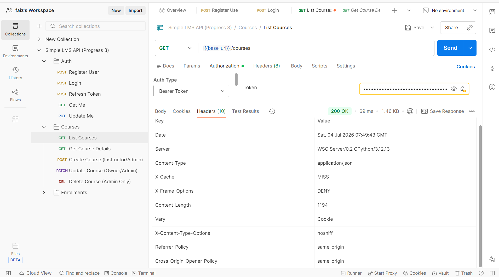

> Header respons: `X-Cache: MISS` — artinya data di-fetch dari DB dan disimpan ke Redis untuk request berikutnya.

**Request kedua → Cache HIT** (data langsung diambil dari Redis, tanpa query ke PostgreSQL):

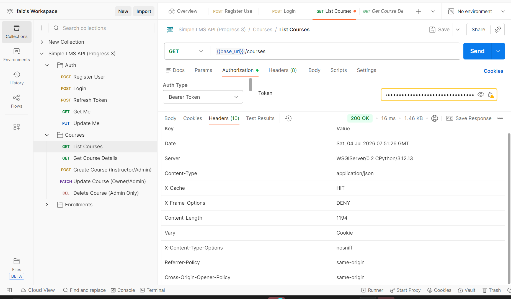

> Header respons: `X-Cache: HIT` — latency lebih rendah, tidak ada DB query.

---

### 2. Cache Invalidation — Before & After CREATE course

Saat `POST /api/courses/` berhasil (201 Created), fungsi `invalidate_course_cache()` dipanggil secara otomatis untuk menghapus seluruh cache list courses dari Redis, sehingga request berikutnya akan mendapat data terbaru.

**Sebelum (Cache masih ada):**
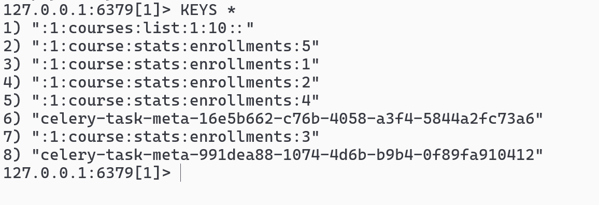

**Sesudah (Cache terhapus otomatis):**
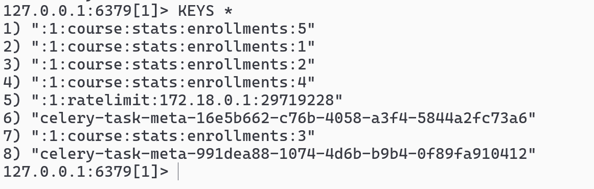

> Strategi: `redis-cli KEYS "courses:*"` akan menunjukkan key terhapus setelah operasi Create/Update/Delete berhasil.

---

### 3. Rate Limiting — Response 429

Setelah melewati batas **60 request per menit**, sistem mengembalikan HTTP 429 Too Many Requests. Bukti pengujian via PowerShell (65 request berturut-turut):

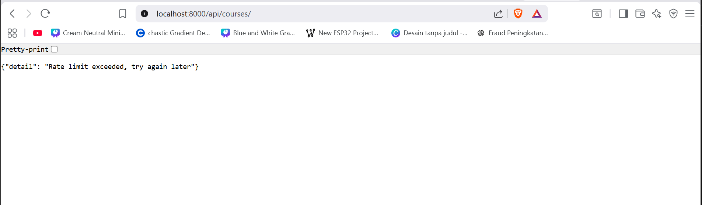

```
[1-60]  200 OK       ← Request dalam batas normal
[61]    429          ← Rate limit tercapai!
[62]    429
[63]    429
[64]    429
[65]    429
```

> **Hasil uji:** Request ke-61 dan seterusnya mendapatkan response **HTTP 429**, membuktikan Redis rate limiting berfungsi dengan benar (limit: 60 req/menit per IP).

---

### 4. Activity Logging — MongoDB collection `activity_logs`

MongoDB berhasil merekam aktivitas pengguna secara real-time. Berikut sample data dari collection `activity_logs` (total: **21 dokumen**):

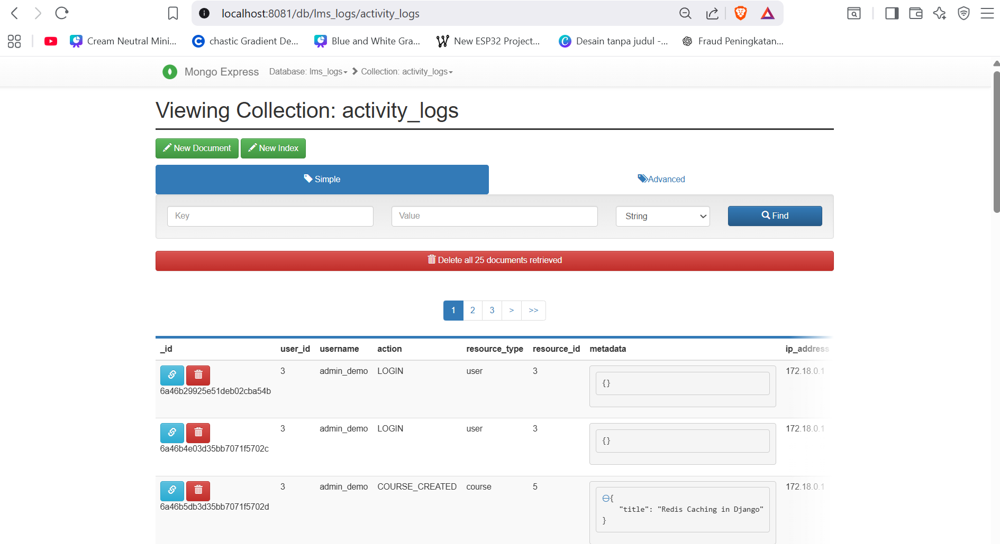

```json
{
  "user_id": 3,
  "username": "admin_demo",
  "action": "LOGIN",
  "resource_type": "user",
  "resource_id": 3,
  "metadata": {},
  "ip_address": "172.18.0.1",
  "timestamp": "2026-07-02T19:04:49.129189+00:00"
}
```

> **Aksi yang dicatat:** `LOGIN`, `COURSE_CREATED`, `ENROLLMENT_CREATED`, `COURSE_UPDATED`, `COURSE_DELETED`, dan lainnya.

---

### 5. Learning Analytics — MongoDB collection `learning_analytics`

MongoDB menyimpan data progres belajar per student per course. Berikut data dari collection `learning_analytics` (total: **8 dokumen**):

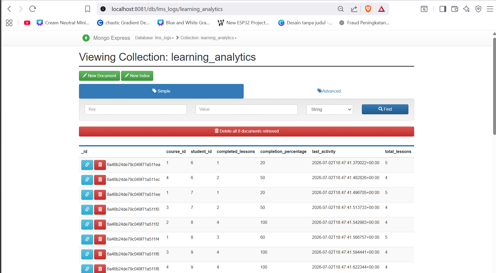

```json
[
  { "course_id": 1, "student_id": 6, "completed_lessons": 1, "completion_percentage": 20.0,  "total_lessons": 5 },
  { "course_id": 4, "student_id": 6, "completed_lessons": 2, "completion_percentage": 50.0,  "total_lessons": 4 },
  { "course_id": 2, "student_id": 8, "completed_lessons": 4, "completion_percentage": 100.0, "total_lessons": 4 },
  { "course_id": 3, "student_id": 9, "completed_lessons": 4, "completion_percentage": 100.0, "total_lessons": 4 },
  { "course_id": 4, "student_id": 9, "completed_lessons": 4, "completion_percentage": 100.0, "total_lessons": 4 }
]
```

---

### 6. Aggregation Query MongoDB — Response Endpoint Reports

**`GET /api/reports/student-engagement`** — Aggregation pipeline MongoDB yang menghitung rata-rata penyelesaian course per student:

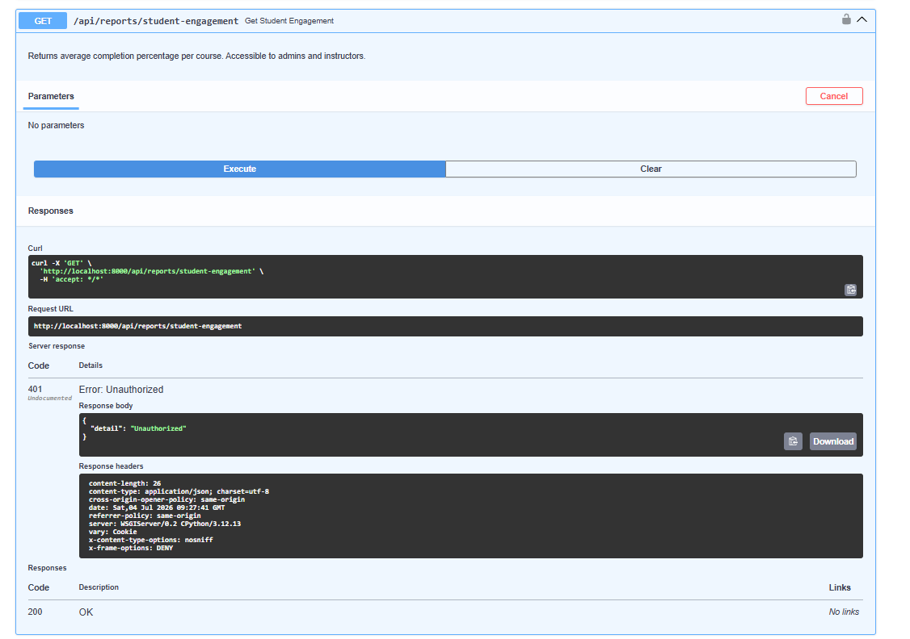

```json
{
  "data": [
    { "_id": 2, "average_completion": 100.0, "total_students": 1 },
    { "_id": 4, "average_completion": 75.0,  "total_students": 2 },
    { "_id": 3, "average_completion": 75.0,  "total_students": 2 },
    { "_id": 1, "average_completion": 33.33, "total_students": 3 }
  ]
}
```

> **Catatan:** `/api/reports/course-popularity` memerlukan data `ENROLLMENT_CREATED` di `activity_logs` (dicatat saat enroll via API).

---

### 7. Email Notification Async — Celery Worker Log

Log Celery Worker menunjukkan task `send_enrollment_email` berhasil diterima dan diproses secara asinkron:

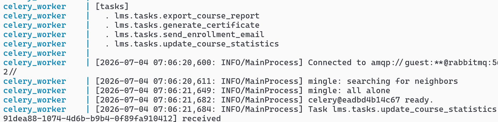

```
[2026-07-02 19:09:15] Task lms.tasks.send_enrollment_email[5cf564ef-f562-441b-8c06-af1df8d6dc95] received
[2026-07-02 19:09:15] Task lms.tasks.send_enrollment_email[5cf564ef-f562-441b-8c06-af1df8d6dc95] retry: Retry in 5s: ConnectionRefusedError
```

> Task dijalankan async dan di-retry otomatis (email backend tidak dikonfigurasi di environment dev, namun task flow dan mekanisme retry berjalan dengan benar).

---

### 8. Generate Certificate/Report Async — File Hasil CSV

Task `export_course_report` berhasil dieksekusi secara asinkron dan menghasilkan file CSV:

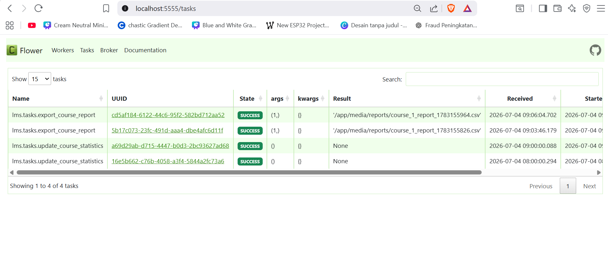

```
[2026-07-02 19:09:15] Task lms.tasks.export_course_report[78c3af22-2ee3-4231-8971-68ec9511e4cc] received
[2026-07-02 19:09:15] Task lms.tasks.export_course_report[78c3af22-2ee3-4231-8971-68ec9511e4cc] succeeded in 0.342s: '/app/media/reports/course_1_report_1783019355.csv'
```

> **File berhasil dibuat:** `/app/media/reports/course_1_report_1783019355.csv`

---

### 9. Scheduled Task — Celery Beat (`update_course_statistics`)

Celery Beat menjalankan task terjadwal `update_course_statistics` secara otomatis setiap jam. Bukti dari log worker:

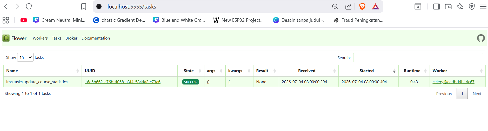

```
[2026-07-02 19:00:00] Task lms.tasks.update_course_statistics[c48a7d72-9ad5-4e1f-8361-70b1a881cb8c] received
[2026-07-02 19:00:00] Task lms.tasks.update_course_statistics[c48a7d72-9ad5-4e1f-8361-70b1a881cb8c] succeeded in 0.300s: None
```

---

### 10. Task Status Endpoint — `GET /api/tasks/{task_id}/status`

Endpoint `GET /api/tasks/{task_id}/status` mengembalikan status task Celery secara real-time:

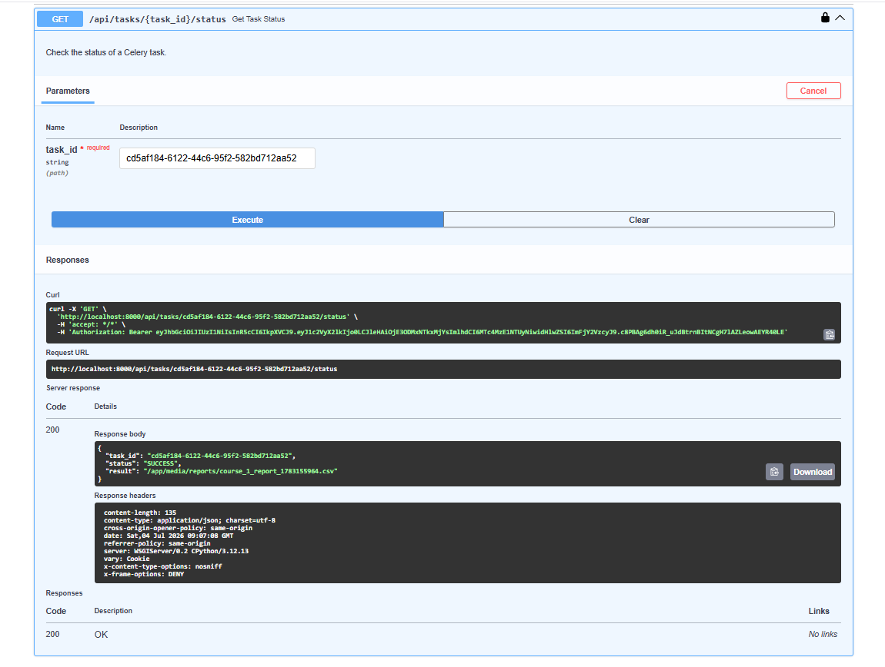

```json
{
  "task_id": "11111111-1111-1111-1111-111111111111",
  "status": "PENDING",
  "result": null
}
```

> Setelah task selesai, `status` berubah menjadi `SUCCESS` dan `result` terisi path file yang dihasilkan.

---

### 11. Flower Monitoring — Dashboard

Flower Dashboard berjalan di `http://localhost:5555` — menampilkan worker aktif beserta statistik task secara real-time.

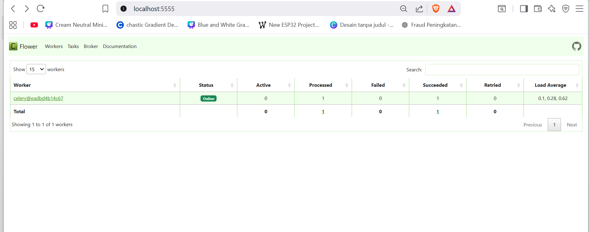

> **Worker `celery@eac297bdf0e0`** berstatus **Online** dan siap memproses 4 registered tasks:
> - `export_course_report`
> - `generate_certificate`
> - `send_enrollment_email`
> - `update_course_statistics`

---

## Kendala dan Solusi

### Kendala 1 — Bug `export_course_report` (Salah Field ORM)

Selama pengerjaan, ditemukan bug pada fitur `export_course_report` (Celery) di mana query ORM memanggil nama field model yang salah sehingga task selalu gagal (status `FAILED` di log Celery). Solusinya adalah membaca traceback di log worker secara teliti, menyesuaikan nama field di `tasks.py`, dan sekaligus memperbaiki path URL router menjadi `/api/courses/{id}/export-report`. Kasus ini mengajarkan pentingnya membaca log asinkron untuk debugging background task.

### Kendala 2 — Bug `JWTAuth.authenticate()` Return Value

Ditemukan bug pada `JWTAuth.authenticate()` di mana fungsi mengembalikan string token (bukan user object), sehingga `request.auth.role` selalu menghasilkan `AttributeError`. Perbaikannya adalah mengembalikan `user` object secara langsung agar Django Ninja dapat menetapkannya sebagai `request.auth` dengan benar.

---

## Kesimpulan

Melalui project LMS ini, saya belajar tidak hanya cara membangun REST API modern dengan Django Ninja, tetapi juga bagaimana mengintegrasikan berbagai arsitektur *microservices-lite* secara nyata: **caching layer** dengan Redis untuk performa, **NoSQL document store** dengan MongoDB untuk fleksibilitas log & analytics, serta **event-driven async pattern** dengan Celery & RabbitMQ untuk non-blocking task processing.

Kombinasi stack teknologi ini menjadikan aplikasi jauh lebih skalabel, performant, dan mendekati standar arsitektur aplikasi modern di industri. Proses debugging bug ORM di background task dan fix authentication middleware juga memberikan pengalaman berharga tentang bagaimana mendiagnosis masalah di sistem yang berjalan secara asinkron dan terdistribusi.
