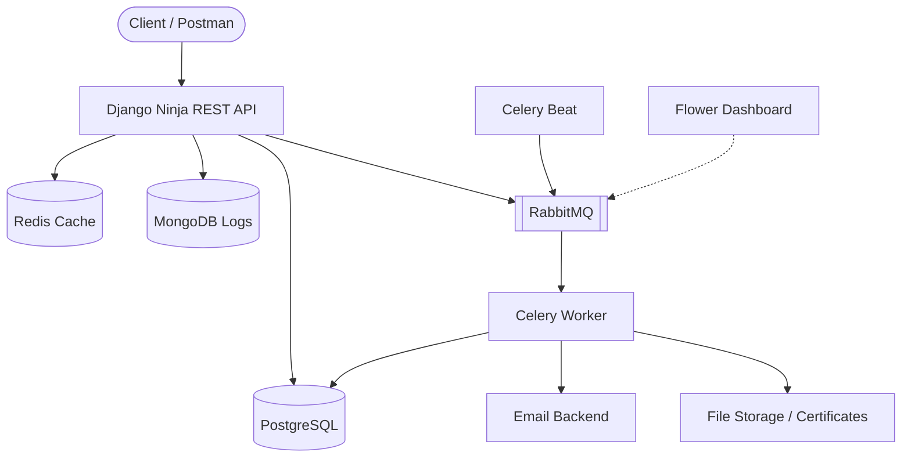
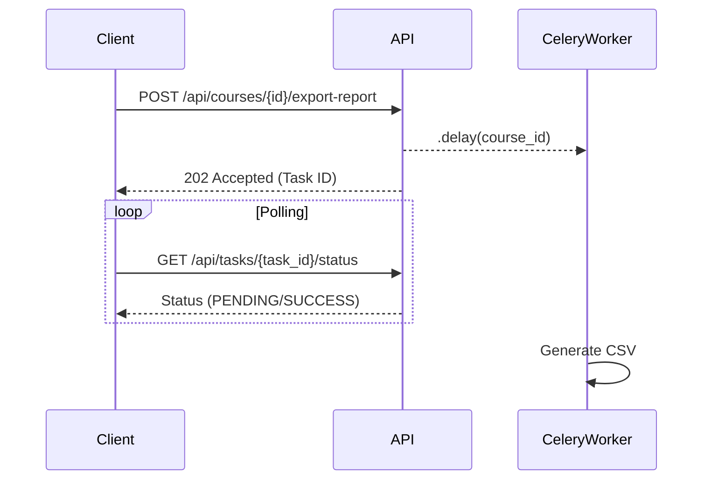

# Simple LMS

Simple LMS adalah project Learning Management System (LMS) sederhana berbasis Django, PostgreSQL, Redis, MongoDB, dan Celery.

Project ini dibuat untuk memenuhi tugas Capstone Progress 1, 2, 3, dan 4:

- **Progress 1**: Docker & Django Foundation
- **Progress 2**: Database Design & ORM Implementation
- **Progress 3**: REST API dengan Django Ninja, JWT Auth, RBAC
- **Progress 4**: Infrastructure, Caching (Redis), Document Store (MongoDB), dan Async Tasks (Celery & RabbitMQ)

---

## 🚀 Architecture Diagram (Progress 4)



---

## 🛠️ Cara Menjalankan Project

### 1. Clone Repository
```bash
git clone <repo-url>
cd simple-lms
```

### 2. Jalankan Docker
```bash
docker-compose up --build -d
```
*Catatan Progress 4: Docker Compose akan menjalankan 8 service: `web`, `db`, `redis`, `mongodb`, `rabbitmq`, `celery-worker`, `celery-beat`, dan `flower`.*

### 3. Jalankan Migration
```bash
docker-compose exec web python manage.py makemigrations
docker-compose exec web python manage.py migrate
```

### 4. Buat Superuser (Opsional)
```bash
docker-compose exec web python manage.py createsuperuser
```

### 5. Akses Project
- Django App ➡️ http://localhost:8000
- Django Admin ➡️ http://localhost:8000/admin
- API Docs (Swagger) ➡️ http://localhost:8000/api/docs
- Postman Collection ➡️ Import file `postman_collection.json` ke Postman
- **Flower Monitoring (Progress 4)** ➡️ http://localhost:5555
- **RabbitMQ Dashboard** ➡️ http://localhost:15672 (User/Pass: `guest` / `guest`)

### 6. Menjalankan Test
Untuk menjalankan unit test (Testing APIs, Models, Celery Tasks, RBAC, dll):
```bash
docker-compose exec web python manage.py test lms.tests
```

## 🌼 Flower Dashboard


---

## ⚙️ Environment Variables

Project ini menggunakan konfigurasi berikut (di `docker-compose.yml` & `.env.example`):

| Variable | Keterangan |
|----------|------------|
| DB_NAME / POSTGRES_DB | Nama database |
| DB_USER / POSTGRES_USER | Username database |
| DB_PASSWORD / POSTGRES_PASSWORD | Password database |
| DB_HOST | Host database (db) |
| DB_PORT | Port database (5432) |
| REDIS_URL | URL koneksi Redis |
| MONGO_URI | URI koneksi MongoDB |
| MONGO_DB_NAME | Nama database MongoDB |
| CELERY_BROKER_URL | URL koneksi RabbitMQ |

---

## 🌟 Features Progress 1-3

### Progress 1
- Docker
- Setup Django
- PostgreSQL
- Project jalan di localhost

### Progress 2
- Models (User, Course, dll)
- Relasi database
- Django Admin
- Query Optimization
- N+1 Demo

### Progress 3
- REST API dengan Django Ninja
- JWT Authentication (PyJWT) & Role-Based Access Control (RBAC)
- Swagger UI dokumentasi otomatis (Support Bearer Token)
- Pydantic schema validation
- CRUD endpoints untuk Course (Protected)
- Enrollment & Progress tracking (Protected)
- Postman Collection ready

---

## ⚡ Features Progress 4

### Caching Strategy & Rate Limiting (Redis)
- **Rate Limiting**: Dibatasi 60 request/menit (per user ID jika login, atau per IP jika anonymous). Melewati batas akan return `429 Too Many Requests`.
- **Cache-Aside Pattern**: Endpoint `GET /api/courses` dan `GET /api/courses/{id}` membaca dari Redis. Jika cache miss (tidak ada), maka akan query ke PostgreSQL lalu disimpan ke Redis (TTL 5 menit).
- **Cache Invalidation**: Setiap kali ada operasi POST (Create), PATCH (Update), atau DELETE (Hapus) pada course, cache yang terkait akan dihapus secara otomatis.

### Asynchronous Tasks (Celery)

Alur Task (Contoh Export Report):



| Task Name | Trigger |
|-----------|---------|
| `send_enrollment_email` | `.delay()` ketika student berhasil enroll |
| `generate_certificate` | `.delay()` ketika progress student 100% |
| `update_course_statistics`| Scheduled task tiap 1 jam (Celery Beat) |
| `export_course_report` | Endpoint `/export-report` (Async) |

---

## 🔌 API Endpoints

### Auth
| Method | Endpoint | Akses | Deskripsi |
|--------|----------|-------|-----------|
| POST | `/api/auth/register` | Public | Register user baru (student/instructor) |
| POST | `/api/auth/login` | Public | Mendapatkan access & refresh token |
| POST | `/api/auth/refresh` | Public | Refresh token |
| GET | `/api/auth/me` | JWT | Lihat profile user login |
| PUT | `/api/auth/me` | JWT | Update profile user login |

### Courses
| Method | Endpoint | Akses | Deskripsi |
|--------|----------|-------|-----------|
| GET | `/api/courses` | Public | List semua course (pagination + filter) |
| GET | `/api/courses/{id}` | Public | Detail course |
| POST | `/api/courses` | Instructor | Buat course baru |
| PATCH | `/api/courses/{id}` | Owner/Admin | Update course |
| DELETE | `/api/courses/{id}` | Admin | Hapus course |

### Enrollments
| Method | Endpoint | Akses | Deskripsi |
|--------|----------|-------|-----------|
| POST | `/api/enrollments` | Student | Daftar ke course |
| GET | `/api/enrollments/my-courses` | Student | Course yang diikuti student |
| POST | `/api/enrollments/{id}/progress` | Student | Update progress lesson |

### Reports & Analytics (Progress 4)
| Method | Endpoint | Akses | Deskripsi |
|--------|----------|-------|-----------|
| GET | `/api/reports/course-popularity` | Admin/Instructor | Agregasi MongoDB untuk popularitas course |
| GET | `/api/reports/student-engagement` | Admin/Instructor | Agregasi MongoDB untuk rata-rata penyelesaian course |

### Tasks (Progress 4)
| Method | Endpoint | Akses | Deskripsi |
|--------|----------|-------|-----------|
| GET | `/api/tasks/{id}/status` | JWT | Cek status Celery task |
| POST | `/api/courses/{id}/export-report` | Owner/Admin | Trigger task export CSV (Async) |

---

## 📦 Data Models

### PostgreSQL (Transactional Data)
- User, Category, Course, Lesson, Enrollment, Progress

### MongoDB (Document Store)
- **activity_logs**: Menyimpan log aksi user (REGISTER, LOGIN, COURSE_CREATED, ENROLLMENT_CREATED, dll).
- **learning_analytics**: Menyimpan analytics progres murid, otomatis upsert ketika progress diupdate.

---

## 🛠️ Tech Stack
- Python 3.13
- Django 6
- PostgreSQL
- Docker & Docker Compose
- Django Ninja (REST API)
- Pydantic (Schema Validation)
- Redis (Caching & Rate Limiting)
- MongoDB (Document Store)
- Celery & RabbitMQ (Async Background Tasks)

---

## 📄 Struktur Folder Utama

```
simple-lms/
├── config/
│   ├── settings.py
│   └── celery.py        <-- Celery App Config
├── lms/
│   ├── api.py           <-- Main Router
│   ├── middleware.py    <-- Redis Rate Limiting
│   ├── mongo.py         <-- MongoDB Client & Helpers
│   ├── tasks.py         <-- Celery Tasks
│   └── ...
├── docs/
│   └── redis-commands.md <-- Redis CLI Guide
├── docker-compose.yml
├── requirements.txt
└── .env.example
```