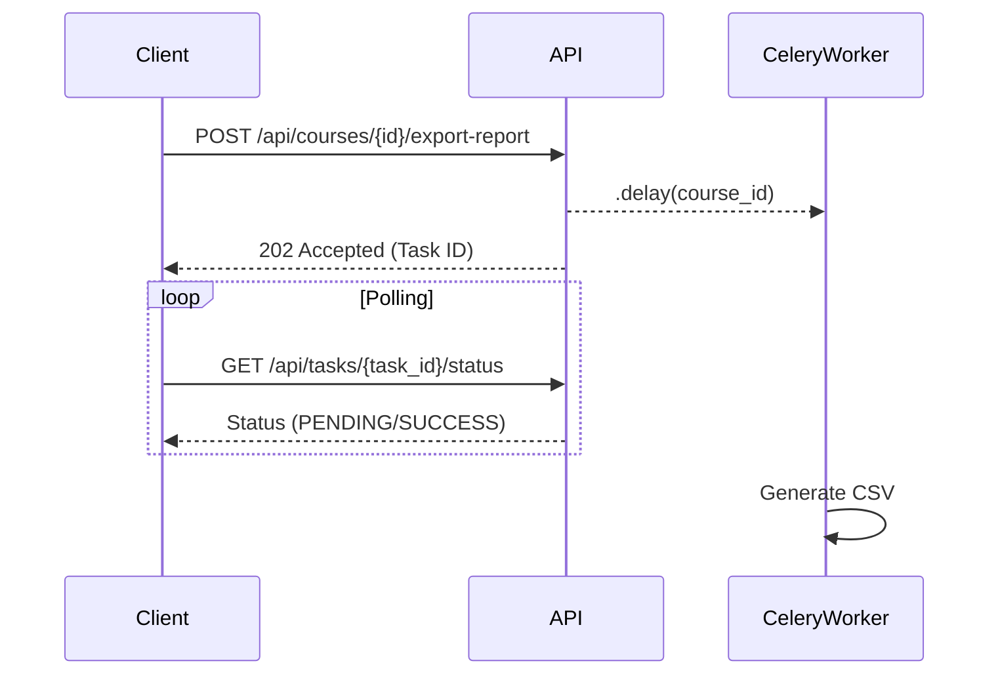

# Simple LMS

Simple LMS adalah project Learning Management System (LMS) sederhana berbasis Django, PostgreSQL, Redis, MongoDB, dan Celery.

Project ini dibuat untuk memenuhi tugas Capstone Progress 1, 2, 3, dan 4:

- **Progress 1**: Docker & Django Foundation
- **Progress 2**: Database Design & ORM Implementation
- **Progress 3**: REST API dengan Django Ninja, JWT Auth, RBAC
- **Progress 4**: Infrastructure, Caching (Redis), Document Store (MongoDB), dan Async Tasks (Celery & RabbitMQ)

---

## 🚀 Architecture Diagram


---

## 🛠️ Cara Menjalankan Project (Progress 4)

### 1. Clone Repository
```bash
git clone <repo-url>
cd simple-lms
```

### 2. Jalankan Docker
```bash
docker-compose up --build -d
```
*Docker Compose akan menjalankan 8 service: `web`, `db`, `redis`, `mongodb`, `rabbitmq`, `celery-worker`, `celery-beat`, dan `flower`.*

### 3. Jalankan Migration
```bash
docker-compose exec web python manage.py makemigrations
docker-compose exec web python manage.py migrate
```

### 4. Akses Project
- Django App ➡️ http://localhost:8000
- API Docs (Swagger) ➡️ http://localhost:8000/api/docs
- **Flower Monitoring** ➡️ http://localhost:5555

## 🌼 Flower Dashboard


---

## ⚡ Caching Strategy & Rate Limiting (Redis)

- **Rate Limiting**: Dibatasi 60 request/menit (per user ID jika login, atau per IP jika anonymous). Melewati batas akan return `429 Too Many Requests`.
- **Cache-Aside Pattern**: Endpoint `GET /api/courses` dan `GET /api/courses/{id}` membaca dari Redis. Jika cache miss (tidak ada), maka akan query ke PostgreSQL lalu disimpan ke Redis (TTL 5 menit).
- **Cache Invalidation**: Setiap kali ada operasi POST (Create), PATCH (Update), atau DELETE (Hapus) pada course, cache yang terkait akan dihapus secara otomatis (`cache.delete` atau `cache.iter_keys`).

---

## 📊 Asynchronous Tasks (Celery)

Alur Task (Contoh Export Report):



| Task Name | Trigger |
|-----------|---------|
| `send_enrollment_email` | `.delay()` ketika student berhasil enroll |
| `generate_certificate` | `.delay()` ketika progress student 100% |
| `update_course_statistics`| Scheduled task tiap 1 jam (Celery Beat) |
| `export_course_report` | Endpoint `/export-report` (Async) |

---

## 📦 Data Models

### PostgreSQL (Transactional Data)
- User, Category, Course, Lesson, Enrollment, Progress

### MongoDB (Document Store)
- **activity_logs**: Menyimpan log aksi user (REGISTER, LOGIN, COURSE_CREATED, ENROLLMENT_CREATED, dll).
- **learning_analytics**: Menyimpan analytics progres murid, otomatis upsert ketika progress diupdate.

---

## 📁 API Endpoints Tambahan (Progress 4)

### Reports & Analytics
| Method | Endpoint | Akses | Deskripsi |
|--------|----------|-------|-----------|
| GET | `/api/reports/course-popularity` | Admin/Instructor | Agregasi MongoDB untuk popularitas course |
| GET | `/api/reports/student-engagement` | Admin/Instructor | Agregasi MongoDB untuk rata-rata penyelesaian course |

### Tasks
| Method | Endpoint | Akses | Deskripsi |
|--------|----------|-------|-----------|
| GET | `/api/tasks/{id}/status` | JWT | Cek status Celery task |
| POST | `/api/courses/{id}/export-report` | Owner/Admin | Trigger task export CSV (Async) |

---

## 📄 Struktur Folder Utama

```
simple-lms/
├── config/
│   ├── settings.py
│   └── celery.py        <-- Celery App Config
├── lms/
│   ├── api.py           <-- Main Router
│   ├── middleware.py    <-- Redis Rate Limiting
│   ├── mongo.py         <-- MongoDB Client & Helpers
│   ├── tasks.py         <-- Celery Tasks
│   └── ...
├── docs/
│   └── redis-commands.md <-- Redis CLI Guide
├── docker-compose.yml
├── requirements.txt
└── .env.example
```